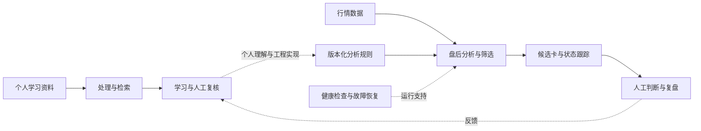

# zAI

### 一个沉默老粉的工程实践

**从录播学习，到每天能用的交易助手。**

> 屏噪音，不乱摸，知行合一。
>
> 顺大势，逆小势，踏踏实实。
>
> —— 项目自勉

2019 年 z 哥第一次直播就在，属于一直在看的“沉默的大多数”。

过去是看直播、做笔记、翻记录。后来开始想：以前讲过的东西能不能更容易找到？每天重复的数据整理能不能自动完成？观察一张图时，能不能把判断依据和后续变化留下来？

zAI 就是我把这些问题逐步做成工具的过程。这个仓库记录系统长什么样、已经做到了什么、还欠哪些能力，以及做错之后学到了什么。

对我来说，“屏噪音”是把注意力留给可复核的信息；“不乱摸”是候选出现后仍然保持耐心；“知行合一”是把理解交给实践检验。“顺大势、逆小势”提醒我同时看环境和局部变化；“踏踏实实”则是每天把数据、观察与复盘做好。这是我对项目的理解，不是对课程判据的定义。

[系统架构](docs/architecture.md) · [选股与交易辅助](docs/trading.md) · [模块地图](docs/modules.md) · [候选的一生](examples/candidate-journey.md) · [Lessons](docs/lessons.md) · [未来方向](docs/roadmap.md)

## 已经做到了什么

| 能力 | 系统中已有的实现 | 从这里看 |
|---|---|---|
| **盘后选股流水线** | 行情获取、候选筛选、结果归档、复盘页面与终端列表集成，覆盖 A 股与美股工作流 | [交易辅助](docs/trading.md) |
| **候选分析与跟踪** | 组织图形判断、风险与目标情景，保留候选状态变化 | [合成案例](examples/candidate-journey.md) |
| **策略版本与评估** | 规则版本化、案例评估、新旧版本对照与回滚入口 | [策略如何迭代](docs/trading.md#策略如何迭代) |
| **录播资料检索** | 文稿处理、全文索引、本地向量化、带来源的 RAG 问答 | [知识模块](docs/modules.md) |
| **视频学习工作流** | 分阶段处理、时间定位、剪辑与笔记产物验收；人工参与，仍在完善 | [学习链路](docs/architecture.md) |
| **运行维护** | 健康状态聚合、依赖诊断、受条件约束的故障恢复与通知 | [运维设计](docs/architecture.md#运行维护) |
| **AI 协作开发** | 独立工作目录、写入范围认领、提交与交接检查 | [协作经验](docs/lessons.md) |

状态快照：**2026-09-10**。以上基于项目文档和相关代码核对，表示已有实现；本次未重跑生产链路，不表示每项能力已完成独立效果验证。这里不发布未经核验的收益、胜率或稳定性数字。

## 系统全景

这是职责概览，虚线包含人工活动；不表示系统会自动从录播提炼规则并直接用于交易。

## 为什么公开

学习如何变成行动，想法如何变成系统，系统出了错又如何改进——这些过程值得留下。

这里可以阅读架构、模块介绍、交易辅助流程和工程复盘。公开示例使用明确标注的合成数据；当前仓库是可阅读的项目档案，尚不提供可运行的交易系统或真实输出截图。

录播、字幕、课程知识、具体交易判据与私有实现不在本仓库发布。[内容边界](docs/boundaries.md)

本项目为个人实践，与 z 哥无官方关联，不代表其观点或背书。系统辅助整理与判断，交易决策由人负责。

## 阅读与验证

直接在 GitHub 打开本页即可，图示使用 Mermaid，无需安装私有系统依赖。

- 第一次看：先读系统全景，再看“候选的一生”。
- 想了解实现思路：阅读架构、模块地图和 Lessons。
- 想了解进展：阅读路线图与 [DEVLOG](DEVLOG.md)。
- 维护本仓库：检查相对链接、示例标注与能力措辞，再执行 `git diff --check`；不从私有仓库同步目录或历史。
