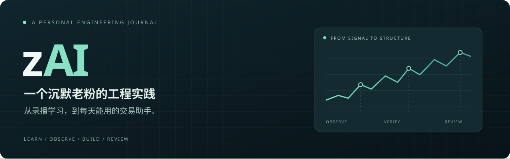
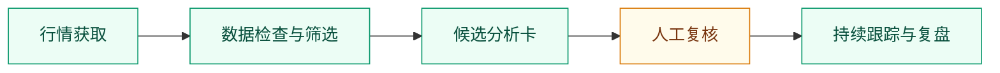
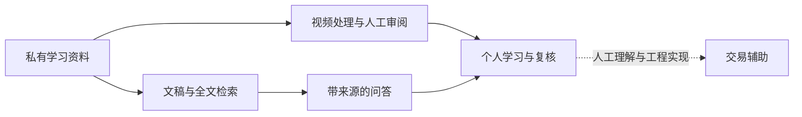

  

<strong>屏噪音，不乱摸，知行合一。 顺大势，逆小势，踏踏实实。</strong>

  <a href="docs/trading.md">选股与交易辅助</a> ·
  <a href="docs/architecture.md">系统架构</a> ·
  <a href="docs/modules.md">模块地图</a> ·
  <a href="docs/lessons.md">Lessons</a> ·
  <a href="docs/roadmap.md">未来方向</a>

---

## 从一个老粉，到一套自己的系统

**2019 年 z 哥第一次直播就在，属于一直在看的“沉默的大多数”。**

以前讲过的东西，能不能更容易找到？每天重复的整理，能不能自动完成？一张图为什么值得看，后来又发生了什么，能不能留下记录？

zAI 是我把这些问题逐步做成工具的过程：**学习资料有入口，选股观察有流程，判断变化有记录，系统运行有反馈。** 这里公开架构、模块能力和工程经验。

## 三条主线，一套日常工作流

<table>
  <tr>
    <td width="33%" valign="top">
      <h3>◈ 交易辅助</h3>
      
从盘后行情到候选卡，再到连续观察与复盘。

      
<strong>扫描 · 跟踪 · 版本评估</strong>

      <a href="zradar/README.md">进入 zradar →</a>
    </td>
    <td width="33%" valign="top">
      <h3>◎ 学习工具</h3>
      
找回讲过的内容，把长录播整理成可导航的学习材料。

      
<strong>检索 · 问答 · 视频加工</strong>

      <a href="zclip/README.md">进入 zclip →</a>
    </td>
    <td width="33%" valign="top">
      <h3>▤ 工程与运维</h3>
      
知道链路卡在哪里，也知道每次工作留下了什么。

      
<strong>诊断 · 恢复 · 协作看板</strong>

      <a href="zgui/README.md">进入 zgui →</a>
    </td>
  </tr>
</table>

## 把“值得看一眼”变成可跟踪的候选

| 已有能力 | 解决什么问题 |
|---|---|
| **A 股与美股盘后工作流** | 获取行情、生成候选、归档结果，连接复盘页面与终端列表 |
| **候选卡与状态跟踪** | 组织图形判断、风险位置与目标情景，保留后续变化 |
| **规则版本与案例评估** | 看清一次规则调整影响了什么，保留对照和回滚入口 |
| **市场背景与板块信息** | 为观察提供上下文，判断能力持续完善 |

**[看一个候选如何从出现走到结束观察 →](examples/candidate-journey.md)**

手工合成案例，展示信息组织方式；不是实际扫描结果或回测。

## 打开模块看看

目录对应真实模块名。每个文件夹都是可阅读的公开介绍入口，包含职责、输入输出和状态；不含私有实现。

| 交易与数据 | 学习与知识 | 工程与协作 |
|---|---|---|
| [**zradar**](zradar/README.md) · 选股与候选跟踪 | [**zclip**](zclip/README.md) · 录播学习工作流 | [**zgui**](zgui/README.md) · 健康与诊断 |
| [**zdownload**](zdownload/README.md) · 盘后行情 | [**zrag**](zrag/README.md) · 语义检索与问答 | [**zai_shared**](zai_shared/README.md) · 共享基础能力 |
| [**zpipeline**](zpipeline/README.md) · 资料同步 | [**zsearch**](zsearch/README.md) · 全文搜索 | [**zboard**](zboard/README.md) · 项目进度与证据 |
| | [**zdocs**](zdocs/README.md) · 文稿组织 | |
| | [**ztxt**](ztxt/README.md) · 文本镜像 | |

<strong>探索与历史模块</strong> · 明确区分，不计入已有能力

| 目录 | 状态 | 定位 |
|---|---|---|
| [zdict](zdict/README.md) | 规划中 | 术语导航 |
| [zanki](zanki/README.md) | 规划中 | 复习卡片 |
| [zsummary](zsummary/README.md) | 历史职能已并入 zclip | 每期总结 |

## 系统的另一半：把学习接回实践

学习和交易之间有人做判断。虚线表示个人理解与工程工作，不是自动把录播编译成交易规则。技术构成包括 **Python · Meilisearch · BGE-M3 · Chroma · FastAPI · Windows 任务调度**，部分向量化在本地 GPU 上完成。

## 做过之后，留下什么

| 工程 Lessons | 留下的判断 |
|---|---|
| [成功退出，不等于事情做完](docs/lessons.md) | 验收要看产物，不能只看退出码 |
| [自动恢复需要停手条件](docs/lessons.md) | 区分短暂故障与硬故障 |
| [案例评估需要承认样本边界](docs/lessons.md) | 对照结果与泛化能力分别验证 |
| [多个 AI 的共享资源需要有人负责](docs/lessons.md) | worktree 之外，外部写入也要协调 |
| [文档的重复会变成维护负担](docs/lessons.md) | 运行事实有唯一来源，公开快照有日期 |

## 正在往哪里走

| 方向 | 下一步 |
|---|---|
| 判断与评估 | 明确会什么、不会什么 |
| 学习与可靠性 | 完善人工审阅、产物验收与恢复 |
| 公开展示 | 补充合成演示，以及重新核验后的规模指标 |

[完整路线图 →](docs/roadmap.md) · [建设日志 →](DEVLOG.md)

---

状态说明、内容边界与阅读方式

能力快照：**2026-09-10**，基于项目文档与相关代码核对。已有实现不等于独立效果验证；本次未重跑生产链路，不发布未经核验的收益、胜率或稳定性数字。

本仓库是公开项目档案，可直接阅读，无需安装私有依赖。录播、字幕、课程知识、具体交易判据、凭证与私有实现保留在私有空间。合成示例明确标注。[完整内容边界](docs/boundaries.md)

维护时检查链接、示例标注和能力措辞，执行 `git diff --check`；逐篇整理公开内容，不自动同步私有文件或历史。

个人实践 · 与 z 哥无官方关联，不代表其观点或背书 · 系统辅助判断，交易决策由人负责

