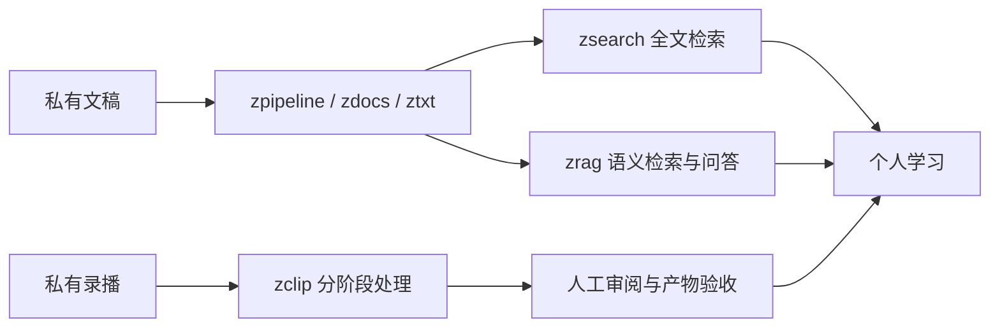
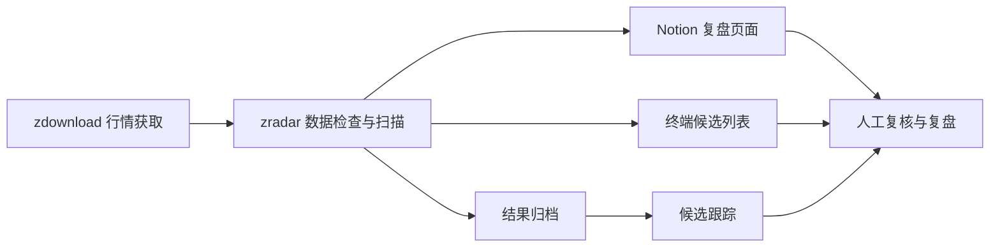

# 系统架构

系统分为学习、交易辅助和运行维护三个部分。下面展示模块职责，不展开知识内容、规则细节或部署配置。

## 学习链路

检索链路帮助找回资料；zclip 支持转写、定位、剪辑和笔记等处理阶段。剪辑与成片审阅包含人工关卡，不能描述成全自动出片。

RAG 在检索上下文中携带来源位置，并提供来源列表；引用存在不代表回答一定忠实，仍需回看来源。

## 交易辅助链路

规则和参数保留在私有实现中。公开展示的是输入、职责、输出与人工接手的位置。

## 运行维护

zgui 聚合任务健康状态和诊断信息；独立恢复流程按依赖顺序处理可恢复故障。遇到硬故障时停手并报告，避免无限重试。

健康面板负责观察，恢复流程负责执行，二者是不同职责。成功标记和产物状态比单独看进程退出码更有信息量；已有路径的验证强度并不完全一致，后续还需要继续补齐。

## 开发协作

每个写入任务使用独立 worktree 与分支，声明写入范围。共享文件和外部状态需协调，提交、检查、交接有明确步骤。

独立目录隔离工作副本，但不能隔离 Notion、调度器或生产数据；共享资源仍需明确所有者。
