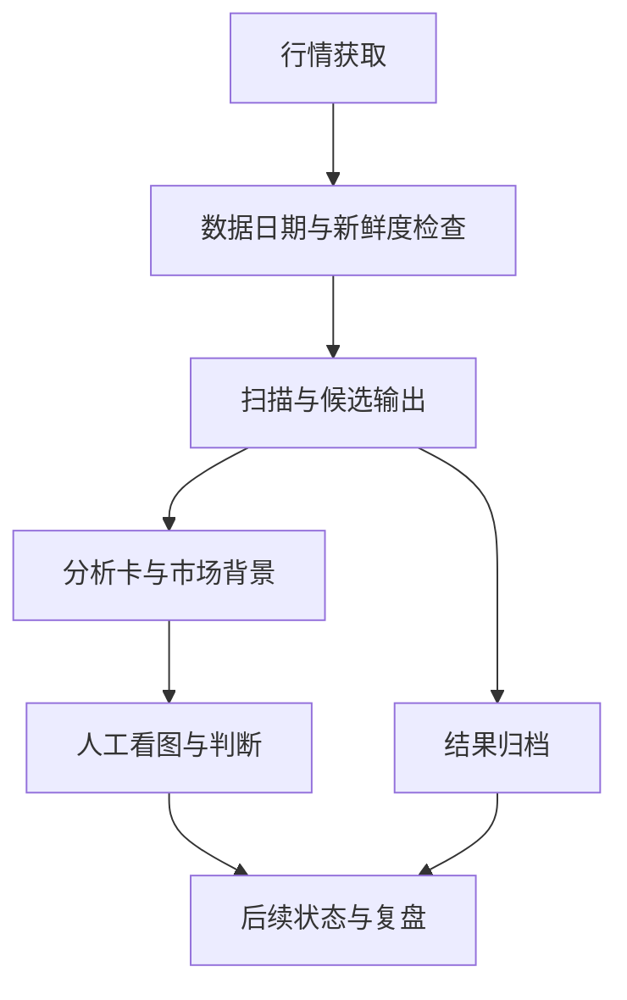

# 选股与交易辅助

每天面对大量图形，困难不只在于“找出一只票”，还在于让观察有顺序、判断有依据、后续有记录。

zAI 的交易辅助围绕这件事展开：把盘后数据变成可复核的候选，把候选放回市场背景中，再持续记录状态。

## 从行情到复盘

这是一张业务概览。市场背景是判断上下文；不能把每个展示字段都理解为已经自动执行的筛选条件。

## 可以看到什么

| 层次 | 关注的问题 | 当前能力与边界 |
|---|---|---|
| 市场背景 | 当前环境怎样影响对候选的理解？ | 有市场风向与板块相关信息组织；完整判断能力持续完善 |
| 候选筛选 | 哪些图值得进一步打开看？ | 有 A 股与美股扫描工作流；具体规则保留在私有系统 |
| 候选分析 | 判断依据、风险位置与目标情景是什么？ | 有候选卡片与相应字段；输出仍需要人工复核 |
| 连续跟踪 | 候选状态如何变化，原判断何时不再成立？ | 有候选链状态与归档；公开案例采用合成叙事 |
| 复盘 | 当时为什么关注它，后来发生了什么？ | 用归档和复盘页面保留过程；不把事后解释替代事前依据 |

## 策略如何迭代

**把规则写进代码只是起点，判断它有没有变好需要另一个过程。**

已有工程机制包括规则版本记录、案例评估、新旧版本对照和回滚入口。它们帮助回答“本次变化影响了什么”，并不自动证明策略有效。

一次值得记录的调整应说明：

1. 想修正什么误判，证据来自哪里。
2. 哪些原有案例受到影响，是否出现新的遗漏。
3. 评估使用了什么样本，哪些样本参与过调参。
4. 还有什么没验证，何时保留观察或回滚。

公开版展示这套工程方法，不列私有条件、阈值和课程规则。不发布当前交易信号；公开案例不对应真实证券。

## 人仍然在环

扫描输出是一份待复核的观察清单。AI 分析、目标情景和风险字段可能有误，需要结合实际信息判断。本仓库不展示自动下单能力，也不将工程完成度当作交易收益的证据。

下一页：[候选的一生——完全合成的展示案例](../examples/candidate-journey.md)
