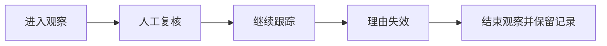

# 候选的一生

> **完全合成的展示案例。** “DEMO-A”是虚构标识；阶段、文案与数字为公开说明手工编写，没有运行真实扫描器，不是生产截图、真实输出、策略回测或交易建议。

## 第一日：进入观察

| 候选卡 | 示例内容 |
|---|---|
| 标识 | DEMO-A（虚构） |
| 当前状态 | 待人工复核 |
| 市场背景 | 背景信息已整理，需结合图形判断 |
| 关注原因 | 某项观察条件出现；私有判据不展开 |
| 主要疑问 | 当前结构能否维持，风险位置是否清楚 |
| 人工意见 | 继续观察，暂不行动 |

系统的价值，是把需要回答的问题放到一起。进入候选并不意味着需要买入。

## 第二日：更新情景

为了说明卡片怎样表达风险，手工设定以下数字：参考位置 100，风险情景位置 96，目标情景位置 108。

| 展示字段 | 合成计算 |
|---|---|
| 参考风险距离 | 100 − 96 = 4 |
| 参考目标距离 | 108 − 100 = 8 |
| 距离比 | 8 ÷ 4 = 2 |

这里的 2 只是两个价格距离的比值，不是期望收益；没有胜率、成交、滑点和费用信息。数字仅展示字段关系，不代表系统采用这些位置或任何固定阈值。

## 第三日：原观察理由失效

人工复核认为原观察理由已不成立，在这个演示里把状态记为“结束观察”，保留第一日与第二日的记录。

这是公开讲解用的阶段命名，不是私有系统状态枚举。

## 复盘留下什么

- 当时为什么关注，以及哪些问题尚未回答。
- 后来出现了什么变化，什么时候发现理由失效。
- 哪些判断来自系统，哪些来自人工。
- 是否需要改进工具，还是只需如实接受这个案例的结果。

一个没有发生交易的候选，也有完整的观察记录。这份示例展示的是信息组织方式，真实输出结构以私有系统为准。
